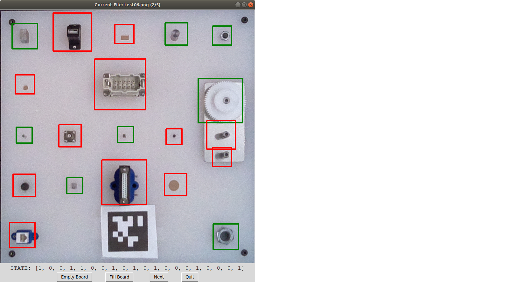

# nist-atb-eval   

## Description  
This package contains tools for data collection, network training, and automatic evaluation of [NIST Assembly Taskboard 1](https://www.nist.gov/el/intelligent-systems-division-73500/robotic-grasping-and-manipulation-assembly/assembly). First, OpenCV is used to extract a taskboard from an image, and warp it into a regular square image using Homography. These nearly identical taskboard images constitute the base for the dataset. Each component is then extracted from the original dataset, and these sub images are used to train an individual neural network for classifying each component. To then evaluate a taskboard, the same process is used to extract the taskboard, split it into component images, and those images are sent through their respective networks in order to get a score for each one. Those scores can then be summed to get an overall score for the board.  

PACKAGE STILL A WORK IN PROGRESS.    

## STAGE 1: Dataset Collection  
  
The universality of the pre-trained models contained in this package is unproven and unlikely considering they were trained on a relatively small dataset in fairly static conditions. Making the trained models more robust is a future goal. So in order to get things working in a new environment, a new dataset will need to be collected. However, it's worth noting that with a set of roughly 200 images, I was able to get a board evaluation accuracy of 98.6% on a testing set.   

To start collecting data you need to set up some kind of overhead camera that can take pictures of the taskboard in various states and positions. Initially we started using an Intel RealSense camera, but the resolution wasn't ideal, so instead we used a Raspberry Pi 4 with an Arducam Auto-Focus 5MP camera module. The Raspberry Pi ran a ROS node with a service let us extract and save taskboard images over wifi. The setup for the ROS Pi Camera is detailed [here](https://github.com/pgavriel/ros_picam).  

For an initial dataset, the easiest thing to do is collect a set of images with all components present, and another set of images for empty boards. This way very little data labeling needs to be done when splitting the taskboard images into training images.  

### Taskboard Extraction (using taskboard_detection.py)   
  
OpenCV is used to extract the precise locations of the four corners of a taskboard, which is then used to warp the taskboard into a square image. Approaching the problem this way provides a very consistent dataset even if the board is rotated or the camera is moved in some way. The way this is currently implemented works, but could be significantly improved or approached differently, because as long as the board corners can be accurately extracted, everything else should still work.  
**taskboard_detection.py** can be imported, and the **process_taskboard(image)** function will take an image and attempt to extract and return a taskboard image like the ones in the dataset. Note that an apriltag is used in our approach as a way of keeping the output orientation consistent. Debug images can be saved to see what's going wrong if things aren't working. The method used is outlined:  
1. Isolate the board   
  - Filter the image     
  - Threshold the image (may need to be adjusted, light surfaces may cause problems)  
  - Find the largest contour in the thresholded image and assume that it's the taskboard  
2. Fix the orientation of the contour based on the apriltag   
3. Refine the corner positions  
  - Masks the image around an inflated taskboard contour  
  - Perform Hough line detection that should detect the edges of the board  
  - Inspect square regions around the original corners, and look for edge line intersections to be the new refined corner positions  
4. Use the refined corner positions to warp the taskboard into a square image using Homography   

### Data Labeling Tool (data_labeler.launch)

This is a tool included to make the process of labeling board data much easier. It will look into a given **source_path** directory, find all the .png images, and go through them one by one, allowing the user to set the states of each component by clicking in their region. Clicking the next button will append the filename and board state to a .csv file specified by the **save_path** and **save_file** arguments in the launch file. The csv created by this tool can be used by **roi_img_split.py** to split all your data into component images with proper labels, which can then be used for training. To use:     
> roslaunch nist_atb_eval data_labeler.launch source_path:=[YOUR IMAGE DIR]    

Arguments can also easily be set directly within the launch file to avoid long command line arguments.   

## STAGE 2: ROI Setup & Data Splitting  
  
Because all the collected taskboard images should be nearly identical, the position of any particular component within each image should be fixed, meaning we can explicitly define image locations to extract each component.  

### roi_config.launch  (roi_config.py)  
This launch file opens an GUI that allows you to visually edit the component regions on top of a reference image. The arguments allow you to specify the csv location, input file, output file, and reference image. Arguments can be set through the command line or by editing the launch file. To use:     
> roslaunch nist_atb_eval roi_config.launch     

When using this GUI, the keyboard controls are:   
**S** - Save current configuration to output file   
**Q** - Quit without saving    
**P** - Toggle step mode    

### image_splitter.launch  (roi_img_split.py)    
Once your ROI csv is set up, this launch file will go through a folder of taskboard images, and use the ROI csv to split each board into labeled component images within appropriately named folders. These folders of labeled components are used to train the networks for evaluation. The arguments allow you to set the source_path, save_path, roi_csv, image output size, and whether to load labels from a csv file, or to simply apply the same board state for each image. Arguments can be set through the command line or by editing the launch file. By running this launch file without changing anything, it will split up the provided test set for you as an example. To use:   
> roslaunch nist_atb_eval image_splitter.launch     

## STAGE 3: Neural Network Setup & Training  

   
### network_trainer.launch  (network_trainer.py)   
After splitting your training data, you should now have 20 folders full of correctly labeled component images (the label should be the first character in the filename). The network_trainer.launch file will allow you to quickly train and test models for any components you specify. Arguments in the launch file are: the path to the folder containing **all** of the component image folders, the path to your set of testing folders, the path to save models to, model version (which is used when evaluating to find the right model), training batch_size, number of epochs, which components to train, and a few others. Train one component at a time, several components (i.e. components:="2 7 9 17 19"), or all of them by setting the components argument to 0. To use:    
> roslaunch nist_atb_eval network_trainer.launch     
     
## STAGE 4: Taskboard Image Evaluation
  
With the networks now trained, we should be able to extract a novel taskboard image, and feed it through the networks to evaluate the board state.  
**network_evaluate.py** defines a TaskboardEvaluator class that should be instantiated with the following:  
*model_dir* - The directory to find the saved .pth files   
*eval_dir* - The directory to find images to be evaluated  
*roi_csv* - Path to .csv file that defines ROIs on the board
*transform* - Transform composition to be performed on the data going into the networks. Should be the same transforms used when training.  
*model_ver* - The model version is just the prefix to look for on the .pth files.  

### TaskboardEvaluator Functions
**load_board(image)** - The argument passed is the file name of the image to evaluate, which should be found in *eval_dir*. This opens the image, finds the ROIs, takes a cropped image for each component, and performs the necessary transforms. The result is a list of 20 tensors stored in TaskboardEvaluator.components that are ready to be fed into their respective networks.  
**eval_board()** - After the board is loaded, this function calls **eval_component(c)** for each component tensor. After this function, the TaskboardEvaluator.scores member should be a list of 20 values representing the presence of the board components.  
**eval_component(component)** - Takes the specified component tensor, runs it through it's respective model, and returns the predicted score.
**save_results()** - *In order to use this you must first set the TaskboardEvaluator.save_dir member for output.* This function will save an image of the original board with green boxes drawn around detected components, and red boxes around components that were not detected. It can be easier to quickly verify accuracy this way.  

### Notes    
apriltag import resolved with pip install apriltag  
imutils import resolved with pip install imutils    

### Deprecated Files  
**old_data_collection.py** - Original data collection was done using a realsense camera, and the code for board detection and extraction was all contained in one file. The relevant functions from this are contained in taskboard_detection.py.   
**old_mse_evaluate.py** - The first method of board evaluation tried to figure out the score for each component based on a Mean Squared Error between a test image, an empty board reference, and a full board reference. While this kind of works, it's not robust to different capture angles.  
**roi_comparison.py** - This is just a script that will get the ROIs for 2 taskboard images and save a bunch of side by side reference images (seen above).  
**import_test.py** - Just a simple test script for checking imports.  
